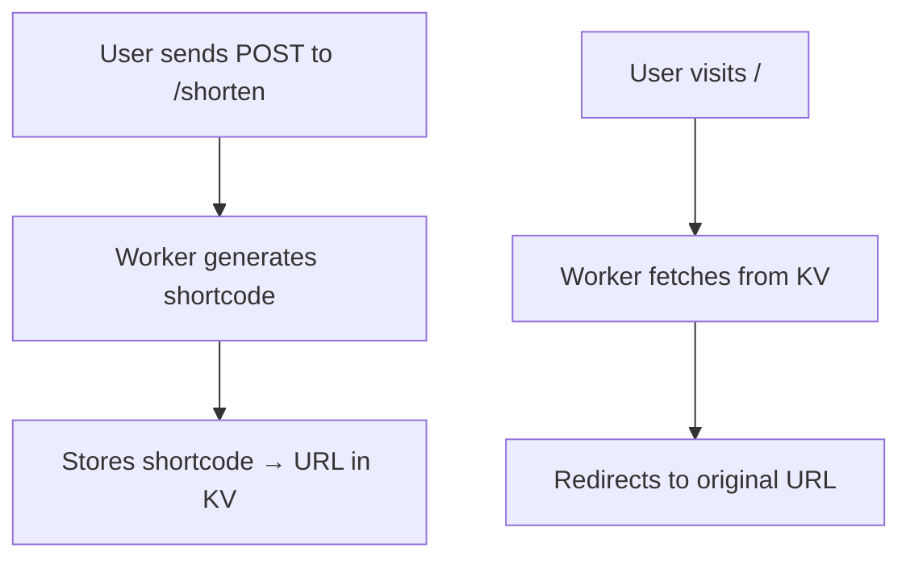

---

```markdown
<p align="center">
  
</p>

<h1 align="center">🔗✨ Cloudflare Workers URL Shortener</h1>

<p align="center">
  <b>Minimal, lightning-fast, serverless URL shortener</b><br />
  Built with <a href="https://developers.cloudflare.com/workers/">Cloudflare Workers</a> + <a href="https://developers.cloudflare.com/workers/platform/namespaces/">KV Namespace</a>
</p>

<p align="center">
  
  
  
</p>


<p align="center">
  
</p>

<h1 align="center">🔗✨ Cloudflare Workers URL Shortener</h1>

<p align="center">
  <b>Minimal, lightning-fast, serverless URL shortener</b><br />
  Built with <a href="https://developers.cloudflare.com/workers/">Cloudflare Workers</a> + <a href="https://developers.cloudflare.com/workers/platform/namespaces/">KV Namespace</a>
</p>

<p align="center">
  
  
  
</p>

---

## 🌟 Features

🟢 **Serverless**: Deployed globally with Cloudflare  
⚡ **Instant redirects** with KV Namespace  
🧠 **Auto shortcode** generation (6-char base36)  
🧪 **Zero dependencies**  
🛡️ **Robust error handling**  

---

## 🛠️ Tech Stack

| Tool                      | Purpose                             |
|------------------------- | -------------------------------------|
| 🧱 Cloudflare Workers   | Edge-based function execution     |
| 🗃️ KV Namespace         | Persistent storage for URL mapping |
| 🔤 TypeScript          | Strongly typed JavaScript        |

---

## 📦 Endpoint Overview

### `POST /shorten` — Shorten a URL

**Request Body:**

```json
{
  "longurl": "https://example.com/very/long/path"
}
```

**Response:**

```json
{
  "shortcut": "https://<your-worker-domain>/<shortcode>",
  "short": "<shortcode>"
}
```

---

### `GET /<shortcode>` — Redirect

- 🔁 **301 Redirect** to long URL  
- ❌ **404 Not Found** if the shortcode is invalid

---

## 🧠 How It Works



---

## 🔧 Wrangler Configuration

Add to your `wrangler.toml`:

```toml
[[kv_namespaces]]
binding = "URLS"
id = "<your-kv-namespace-id>"
```

---

## 🧪 cURL Test

```bash
curl -X POST https://<your-worker-domain>/shorten \
     -H "Content-Type: application/json" \
     -d '{"longurl":"https://example.com"}'
```

---

## 🔮 Improvements To Consider

- ✍️ Custom shortcodes  
- ⏱️ Expiry & time-to-live (TTL)  
- 📊 Analytics dashboard  
- 🔗 Link preview & QR code

---

## 📄 License

This project is licensed under the **MIT License** — free to use, modify, and share.

---

<p align="center">
  
</p>
```

---