  

<h1 align="center">🔗✨ Cloudflare Workers URL Shortener</h1>

  <b>Minimal, lightning-fast, serverless URL shortener</b> 
  <i>Powered by Cloudflare Workers, TypeScript, and KV Namespaces</i>

  
  
  
  

  

---

## 📚 Table of Contents

- [✨ Features](#-features)
- [🚀 Quick Start](#-quick-start)
- [📦 API Endpoints](#-api-endpoints)
- [🧠 How It Works](#-how-it-works)
- [🛠️ Tech Stack](#️-tech-stack)
- [🧪 Example cURL Usage](#-example-curl-usage)
- [🔮 Ideas for Improvement](#-ideas-for-improvement)
- [📄 License](#-license)

---

## ✨ Features

- 🌍 **Globally distributed**: Runs at the edge on Cloudflare’s global network
- ⚡ **Instant redirects**: Ultra-fast URL redirection
- 🗝️ **KV Namespace**: Durable, low-latency storage for URL mappings
- 🔒 **Zero server management**: 100% serverless backend
- 🧑‍💻 **TypeScript**: Type-safe, maintainable codebase

---

## 🚀 Quick Start

1. Clone & Install
git clone https://github.com/yourusername/cloudflare-url-shortener.git
cd cloudflare-url-shortener
npm install

2. Create KV Namespace
npx wrangler kv:namespace create "URLS"

text
Copy the returned `id` and add it to your `wrangler.toml`:
[[kv_namespaces]]
binding = "URLS"
id = "<your-kv-namespace-id>"

text
undefined
3. Develop Locally
npm run dev

Visit http://localhost:8787 in your browser
4. Deploy Globally
npm run deploy

text

---

## 📦 API Endpoints

### ➕ Shorten a URL

`POST /shorten`

**Request Body:**
{
"longurl": "https://example.com/very/long/path"
}

text

**Response:**
{
"shortcut": "https://<your-worker-domain>/<shortcode>",
"short": "<shortcode>"
}

text

---

### 🔗 Redirect

`GET /<shortcode>`

- Instantly redirects to the original URL.
- Returns **404** if the shortcode is not found.

---

## 🧠 How It Works

```mermaid
graph TD
    A[User sends POST to /shorten] --> B[Worker generates shortcode]
    B --> C[Stores shortcode → URL in KV]
    D[User visits /<shortcode>] --> E[Worker fetches from KV]
    E --> F[Redirects to original URL]
```

## 🛠️ Tech Stack

| Tool                   | Purpose                              |
|------------------------|--------------------------------------|
| ☁️ Cloudflare Workers  | Edge-based serverless execution      |
| 🗃️ KV Namespace        | Persistent storage for URL mappings   |
| 🔤 TypeScript          | Type-safe, modern JavaScript         |

---

## 🧪 Example cURL Usage

curl -X POST https://<your-worker-domain>/shorten
-H "Content-Type: application/json"
-d '{"longurl":"https://example.com"}'

text

---

## 🔮 Ideas for Improvement

- ✍️ Custom shortcodes
- ⏱️ Expiry & TTL support
- 📊 Analytics dashboard
- 🔗 QR code generation

---

## 📄 License

MIT - free to use, modify, and share.

---

  

